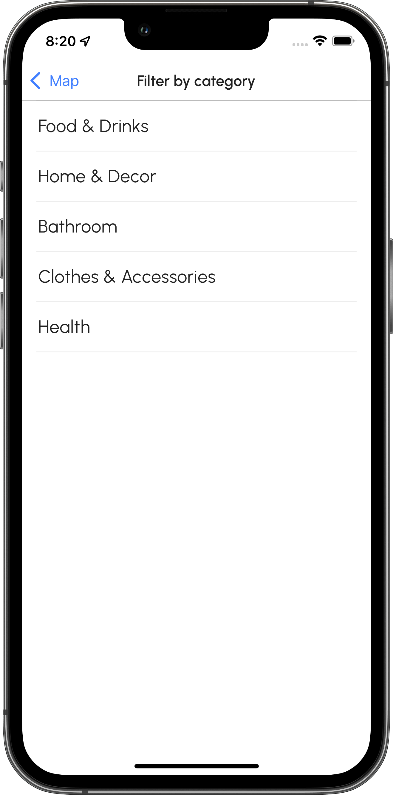
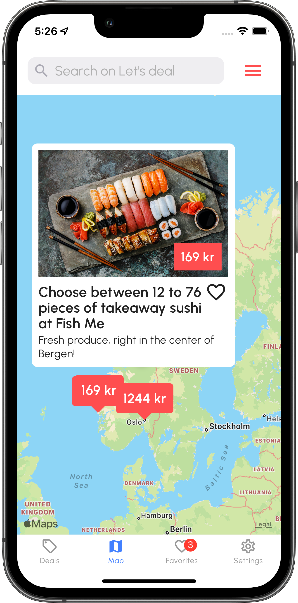

# INFT2508-Letsdeal

<p align="center">

</p>

This assignment is the mandatory requirement for the **(NTNU) INFT2508 Kryss-plattform applikasjonsutvikling for mobile enheter** course to be approved.  

Students can either implement a mobile application using **react-native CLI** based on the product requirements as described below in this document or propose a product (a mobile app description) on their own that they would like to do as a part of their semester project.

<p align="center">  

&nbsp;&nbsp;&nbsp;&nbsp;&nbsp;&nbsp;

&nbsp;&nbsp;&nbsp;&nbsp;&nbsp;&nbsp;

</p>

**Figure 1.** Deals tab,  Map tab, and Favorites tab (Norwegian Bokmål).

## How to run (Apple iOS)

1. Install dependencies and run iOS simulator
```bash
npm install
cd ios; pod install; cd ..
npm run ios
```


2. Run mock api server (in a new window)
```bash
npm run mockapi
```

## Description

This is an app for an _e-commerce marketplace_, where sellers can list their items and potential
buyers can see and buy them. The focus of this project is on the display of items, and not business logic implementation.

By using this app the user will be able to visualize the products in a grid, search and filter them by category, learn more about them through descriptions, and see their location on a map. By tapping on a product, the user will be able to see different previews of the item and give them a like. Liked items will be saved in a specific section in the app.

Furthermore, a tab will be dedicated to the settings where the user will be able to change the language and theme of the application.

## Features

### Tab menu

The tab menu contains:

- The **Deals** tab menu, selected by default.
- The **Map** tab menu, when selected the items will be displayed.
- The **Favorites** tab menu, this will display only liked items.
- The **Settings** tab menu, which will allow users to dynamically change language and themes in the app.

<p align="center">  

&nbsp;

&nbsp;

&nbsp;

</p>

<p align="center">  

&nbsp;

&nbsp;

&nbsp;

</p>

**Figure 2.** Deals tab,  Map tab, Favorites tab, and Settings tab.

### Deals tab

It features a search bar with a filter button on the right side, and a list of items retrieved using REST API calls.  
Items on this page can be liked by tapping the heart button. Once liked the heart fills in red.

<p align="center">  

&nbsp;

&nbsp;

&nbsp;

</p>

**Figure 3.** Scrollable and searchable products view.

### Filters tab

By pressing the hamburger menu on the right side of the search bar, the items are filtered by category.  

The page also features a back button that reflects the color from which it has been accessed.

<p align="center">  

&nbsp;&nbsp;&nbsp;&nbsp;&nbsp;&nbsp;&nbsp;&nbsp;&nbsp;&nbsp;&nbsp;&nbsp;

</p>

**Figure 3.** Filters page accessed by Deals and Map tab.

### Item details page

This page features a thumbnail, a carousel of images, a buy button placed at the bottom and other useful information about the product such as title, description, price and location. The user is able to like or remove like from the item by pressing the heart shaped button, effectively adding the product to the Favorites tab.

Additionally, the images inside the carousel can be open in a fullscreen modal by tapping on them. The displayed images can be zoomed in and swiped, like those in the iOS gallery app.  

In order to contact the seller the call and go-to-website buttons are provided.s

<p align="center">  

&nbsp;&nbsp;&nbsp;&nbsp;&nbsp;&nbsp;

&nbsp;&nbsp;&nbsp;&nbsp;&nbsp;&nbsp;

</p>

**Figure 4.** Item details and preview gallery.

### Map tab

This tab represents all the items as price markers placed on a map. It is possible to search or filter the products by category.  

By pressing on a marker, a callout pops up, showing the title, thumbnail, and like status of the product. When the callout is tapped the details page of the product is displayed.

<p align="center">  

&nbsp;&nbsp;&nbsp;&nbsp;&nbsp;&nbsp;

&nbsp;&nbsp;&nbsp;&nbsp;&nbsp;&nbsp;

</p>

**Figure 5.** Map tab with searchable price markers. Callout pop up on tap.

### Favorites tab

This tab displays all the user's favorite items in a scrollable view. Each item presents the thumbnail, price, and description. And by pressing on one of them the user is able to view its details.  

While by swiping left on an item the user is able to remove it from the favorites list, as if they pressed on the 'unlike' button.

<p align="center">  

&nbsp;&nbsp;&nbsp;&nbsp;&nbsp;&nbsp;

&nbsp;&nbsp;&nbsp;&nbsp;&nbsp;&nbsp;

</p>

**Figure 6.** Favorites tab with removal on swipe left.

### Settings tab

This page contains all the settings that the user can modify: the theme (by tapping on a toggle) and the language (via the language selector page).  

The changes in the settings are applied instantaneously, without rebooting the app. And in case of reboot the changes are kept in the persistent storage.

<p align="center">  

&nbsp;&nbsp;&nbsp;&nbsp;&nbsp;&nbsp;

&nbsp;&nbsp;&nbsp;&nbsp;&nbsp;&nbsp;

</p>

**Figure 7.** Settings tab and language selector.

## Design decisions

I took inspiration from [Let's deal site](https://letsdeal.no/) and [mobile app](https://apps.apple.com/no/app/lets-deal-daily-discounts/id1303646625?platform=iphone). Choosing a minimal design interface, paying attention to the font weight and letter spacing. Where possible I implemented simple and smooth transitions, preferring native components to custom ones.  

Icons and buttons (such as No Results Image) are implemented as SVG icons to support all screen sizes.

The palette is inspired from the site and split into a color palette and a semantic palette. It is possible to codify the palette switch and witness the change in real-time.  

I also focused on small details to make the application whole and more cohesive. Such as the back button color that reflect the color of the tab from which the page has been opened. Also the text input clear button that responds to the theme change or the badge on the favorites icon.

<p align="center">  

</p>

**Figure 8.** Let's deal site.

<p align="center">  


</p>

**Figure 9.** Let's deal iOS App.

## Components

<p align="center">  

</p>

**Figure 10.** Standalone components.

I decided to create small components that mimic those of React Native. Through high customizability and drop in support, developers can personalize the components with minimal effort, following the React Native conventions.  

The components are well documented through comments.  

All of these components respond to theme and language changes automatically.

Some are:

- **Button**: By using the Pressable components provides a feedback to the user by dimming its color. It also features an optional icon on its left.
- **Text**: This mirrors the default Text component. Its font family, size, letter-spacing, and line height are tailored to the application theme. The color changes dinamically.
- **Item**: Takes a product data and displays it on the screen. It is used in the Deals tab and Map tab.
- **PressableRow**: Used in settings, language, and filters tab. Allows for an optional icon to the right to be places. Responds to press.
- **MultiStateToggle**: Used to implement the theme selector on the Settings tab.
- **IconToggle**: It's an icon that toggles on touch. An example is the heart shaped button, used to like a product.
- **PriceMarker**: It's the marker on the map with a special callout that contains an Item component.
- **SearchField**: Mimics the TextInput component, and implements a custom clear text button that reflects the theme color.

The other components are less reused inside the applications.

## Dependencies

- [@react-native-async-storage/async-storage](https://github.com/react-native-async-storage/async-storage)
- [@react-navigation/bottom-tabs](https://github.com/react-navigation/react-navigation/tree/main/packages/bottom-tabs)
- [@react-navigation/native](https://github.com/react-navigation/native)
- [@react-navigation/native-stack](https://github.com/react-navigation/stack)
- [i18n-js](https://github.com/fnando/i18n)
- [react](https://github.com/facebook/react)
- [react-native](https://github.com/facebook/react-native)
- [react-native-gesture-handler](https://github.com/software-mansion/react-native-gesture-handler)
- [react-native-image-zoom-viewer](https://github.com/ascoders/react-native-image-viewer)
- [react-native-localize](https://github.com/zoontek/react-native-localize)
- [react-native-maps](https://github.com/react-native-maps/react-native-maps)
- [react-native-permissions](https://github.com/zoontek/react-native-permissions)
- [react-native-safe-area-context](https://github.com/th3rdwave/react-native-safe-area-context)
- [react-native-screens](https://github.com/software-mansion/react-native-screens)
- [react-native-svg](https://github.com/software-mansion/react-native-svg)
- [react-native-svg-transformer](https://github.com/kristerkari/react-native-svg-transformer)
- [react-native-vector-icons](https://github.com/oblador/react-native-vector-icons)

### Dev dependencies

- [json-server](https://github.com/typicode/json-server)

© 2022 Riccardo Lussana
